# 1. 系统设计
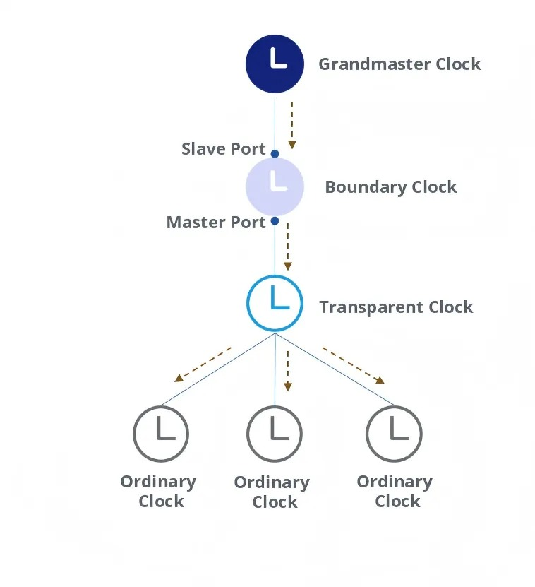

## 1.1 Ordinary clock
对于 ordinary clock 而言，其处理时间事件的方法是  Sync + Follow_up + Delay_Req + Delay_Resp

- 若当前 clock 为 ordinary，则需要记录 SYNC 的时间戳
- 对于 grandmaster 而言，则需要记录 Delay_Req

XGMAC 提供了寄存器 MAC_Timestamp_Control，以配置其具备从 PTP over eth 或者 PTP over udp over ipv4/6 中提取 timestamp 的能力.

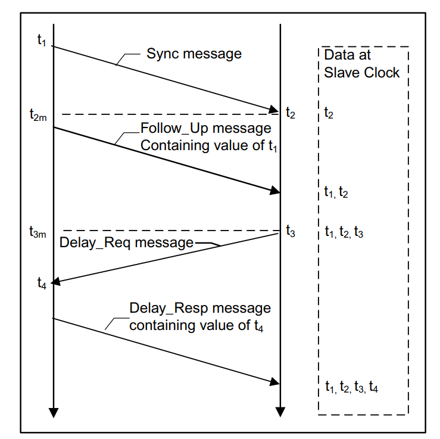

在这种情况下由 ordinary 记录时间信息：GM 广播 SYNC 后发送 Follow_Up 提供 t1，ordinary 自身识别 t2，并通过 Follow_Up 获取 t1。随后 ordinary 回复 Delay_Req 记录 t3 后，由 GM 回复 Delay_Resp 并提供 t4。

## 1.2 E2E transparent clock

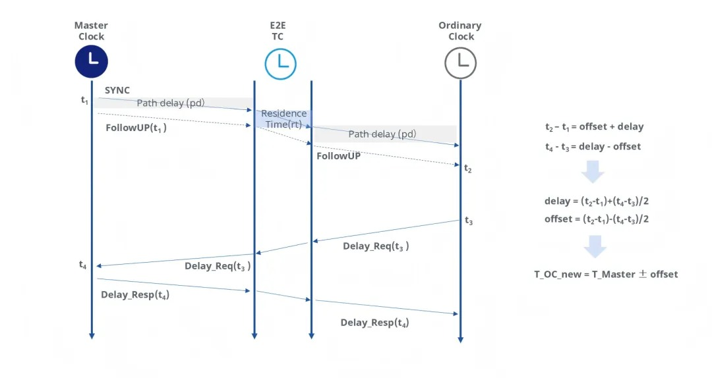

> - t₂ – t₁ = 偏移 + 延迟
> - t₄ – t₃ = 延迟 – 偏移
> - 延迟 = (t₂-t₁)+(t₄-t₃)/2
> - 偏移量 = (t₂-t₁)-(t₄-t₃)/2
> - T_OC_new = T_Master ± 偏移量

E2E TC 的核心问题是将 TC 内部的延时（residence time）更新至到 PTP 包 correctionField 位置。具体而言：

- 在转发 grandmaster clock 的数据时，记录 Sync 包从接收到转发的延时。随后在 FollowUp 包中登记至 CorrectionField。
- 在转发 ordinary clock 的数据时，记录 Delay_Req 的转发延时，并在 Delay_Resp 包中做记录。

若多级 TC 串联，则每一级 TC 都会将自身 residence time 做记录，叠加在 CorrectionField 中。最终ordinary clock 在接收到 PTP 包后，将记录的差值减去 correctionField 记录的时间作为链路延迟。

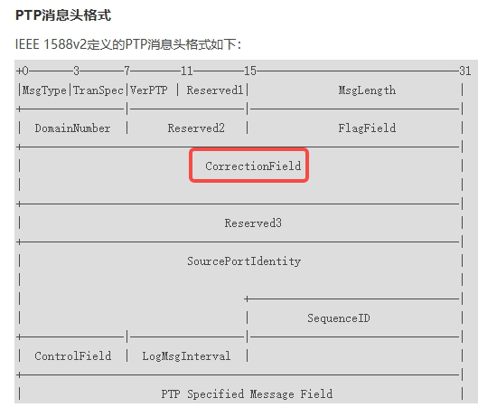

TC 为整个链路带来不确定性。在延时可视为固定值的线路延时的基础上，引入了不可控的软件延时（TC 从接收到发送的延时存在不确定性，例如收到 TC 自身瞬时负载的影响）。因此需要 ordinary 忽略 TC 自身的延迟，只记录硬件的延时。

## 1.3 P2P transparent clock

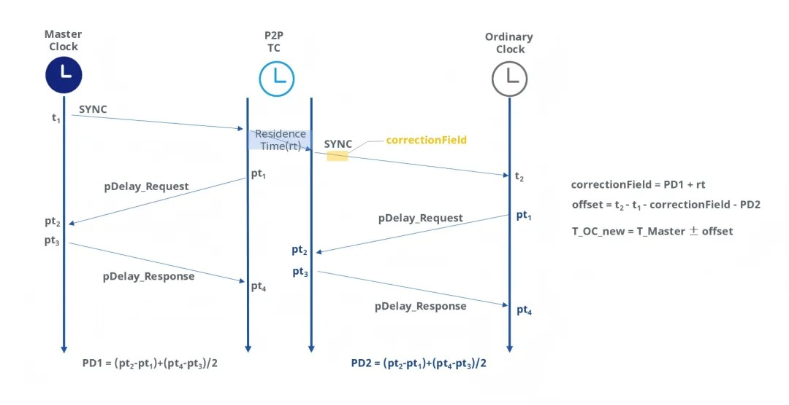

> - PD1 = (pt2-pt₁)+(pt₃-pt2)/2
> - PD2 = (pt₄-pt₁)+(pt₄-pt₃)/2
> - 校正字段（correction field） = PD1 + rt
> - 偏移量 = t₂ – t₁ – 校正字段 – PD2
> - T_OC_new = T_Master ± 偏移量

P2P 的方案相较 E2E 而言精度更高。在该种模式下，OC 只与上一级 TC 之间计算延时 PD2。而最后一个 TC 到 GM 的延时则全部记录在 correctionField 中。

该种方案成本更高，精度更高。其要求整个链路上所有 TC 都支持 PTP，并要求每个 TC 各自记录 PD1/PD2。

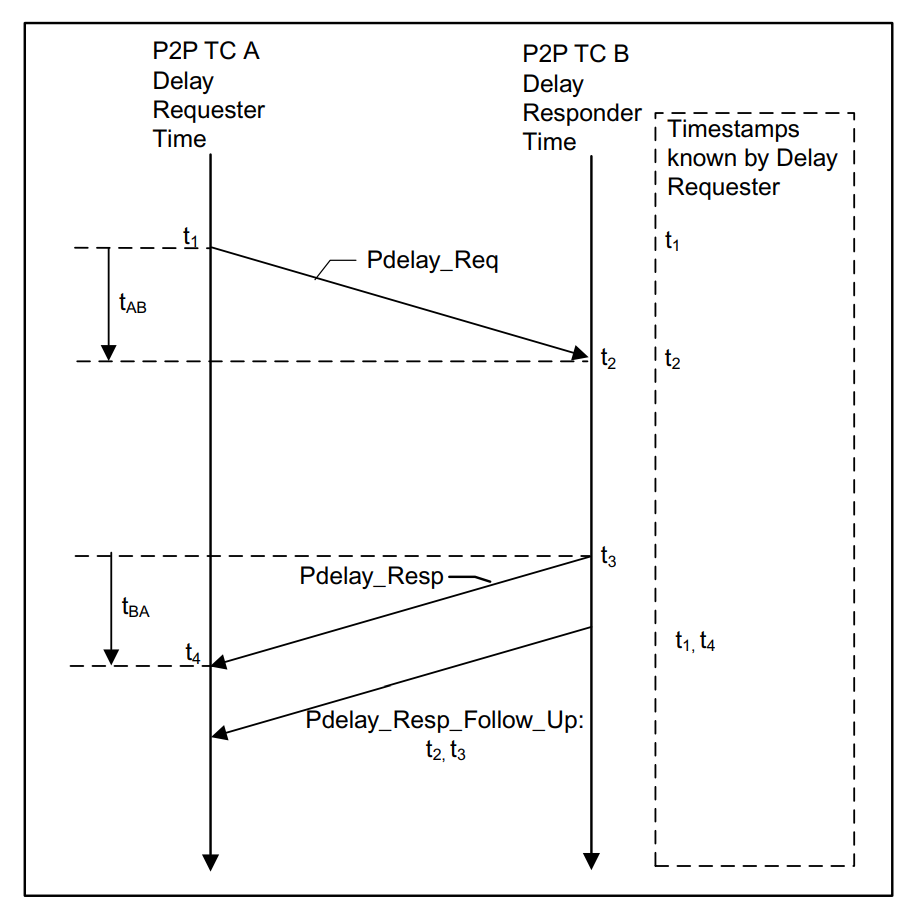

实际计算方法如上： TC-A 发送 Pdelay_Req 并记录 t1，随后 TC-B 回复 Pdelay_Resp 后，TC-A 记录 t4。最后 TC-B 发送 Pdelay_Resp_Follow_Up 将其记录的 t2, t3 送还 TC-A，从而在 TC-A 中保存完整的时间信息。

# 2. XGMAC 硬件特性
## 2.1 Ordinary clock
Ordinary 可以自动记录 SYNC(t2, for slave) 或者 Delay_Req(t4, for master)，对应寄存器：MAC_Timestamp_Control，对应函数：stmmac_hwtstamp_set --> config_hw_tstamping。

Xgmac 可配置为记录类型为 1588v1 or 1588v2。

## 2.2 Boundary clock
Clock data sets / local clock 对所有 boundary 共享

## 2.3 E2E TC
E2E 的核心问题是在转发 SYNC 与 Delay_Req 的时候填充 correction field。方案是需要配置 MAC_Timestamp_Control.SNAPTYPSEL=0'b10

## 2.4 P2P TC

需要配置 SNAPTYPESEL=0'b11，来捕获 SYNC/ Pdelay_Req / Pdelay_Resp 对应的 timestamp

## 2.5 Reference timing source

1588-2002 要求内部有 64bit format reference time，1588-2008 则为 80bit。

xgmac 可配置为外部提供 64bit 时钟源：

- 32 bit upper in seconds
- 32 bit lower in nanoseconds

也可以配置为内部提供一个 80bit 的 referebce clock（system time）并记录 timestamp。

- 48bit for seconds
- 32bit for nanoseconds

需要注意的是高侧 16bit 似乎被保存在了另外的一个名为 CSR 的寄存器里，原因是低侧 32bit 足够支撑 130年，不会轻易溢出。

## 2.6 System timer module

Xgmac 内部集成了一个 system time generator module 作为 reference clock 来记录 timestamps for PTP packet。如果配置为外部输入时钟源的话就没有这个时钟。

# 3. Linux 协议栈框架
## 3.1 初识
1. Stmmac 处理 PTP 的流程

- stmmac_ptp.c
- stmmac_hwtstamp.c

其对外注册一个 ops stmmac_ptp_clock_ops，其 get time 函数最终对应于 stmmac_hwtstamp.c 中的函数 get_systime，其会直接注册到 ptp_clock 中对应于 /dev/ptp0

```c
// stmmac_hwtstamp.c

static void get_systime(void __iomem *ioaddr, u64 *systime)
{
    u64 ns, sec0, sec1;

    /* Get the TSS value */
    sec1 = readl_relaxed(ioaddr + PTP_STSR);
    do {
        sec0 = sec1;
        /* Get the TSSS value */
        ns = readl_relaxed(ioaddr + PTP_STNSR);
        /* Get the TSS value */
        sec1 = readl_relaxed(ioaddr + PTP_STSR);
    } while (sec0 != sec1);

    if (systime)
        *systime = ns + (sec1 * 1000000000ULL);
}
```
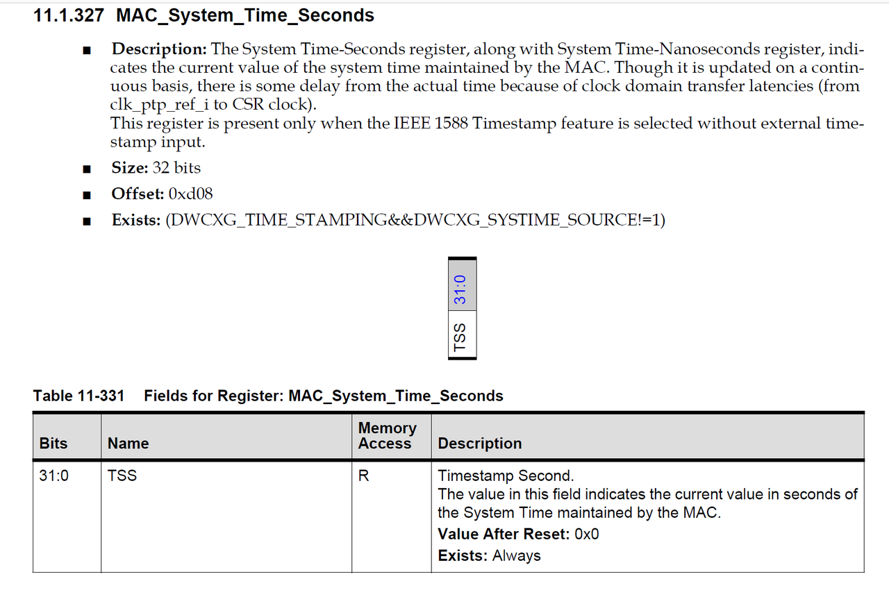

另一路是通过 socket 获取 timestamp，对应 socket.c 中的函数 `get_timestamp`

```c
// socket.c

static ktime_t get_timestamp(struct sock *sk, struct sk_buff *skb, int *if_index)
{
    bool cycles = READ_ONCE(sk->sk_tsflags) & SOF_TIMESTAMPING_BIND_PHC;
    struct skb_shared_hwtstamps *shhwtstamps = skb_hwtstamps(skb);
    struct net_device *orig_dev;
    ktime_t hwtstamp;

    rcu_read_lock();
    orig_dev = dev_get_by_napi_id(skb_napi_id(skb));
    if (orig_dev) {
        *if_index = orig_dev->ifindex;
        hwtstamp = netdev_get_tstamp(orig_dev, shhwtstamps, cycles);
    } else {
        hwtstamp = shhwtstamps->hwtstamp;
    }
    rcu_read_unlock();

    return hwtstamp;
}

static inline ktime_t netdev_get_tstamp(struct net_device *dev,
                    const struct skb_shared_hwtstamps *hwtstamps,
                    bool cycles)
{
    const struct net_device_ops *ops = dev->netdev_ops;

    if (ops->ndo_get_tstamp)
        return ops->ndo_get_tstamp(dev, hwtstamps, cycles);

    // √
    return hwtstamps->hwtstamp;
}
```
此处直接获取 hwtstamp 则是直接在 stmmac_rx 中做的更新：
```c
static int stmmac_rx(struct stmmac_priv *priv, int limit, u32 queue)
{
    // ...
    stmmac_get_rx_hwtstamp(priv, p, np, skb);
    // ...
}

static void stmmac_get_rx_hwtstamp(struct stmmac_priv *priv, struct dma_desc *p,
                   struct dma_desc *np, struct sk_buff *skb)
{
    struct skb_shared_hwtstamps *shhwtstamp = NULL;
    struct dma_desc *desc = p;
    u64 ns = 0;

    if (!priv->hwts_rx_en)
        return;
    /* For GMAC4, the valid timestamp is from CTX next desc. */
    if (priv->plat->has_gmac4 || priv->plat->has_xgmac)
        desc = np;

    /* Check if timestamp is available */
    if (stmmac_get_rx_timestamp_status(priv, p, np, priv->adv_ts)) {
        stmmac_get_timestamp(priv, desc, priv->adv_ts, &ns);

        ns -= priv->plat->cdc_error_adj;

        netdev_dbg(priv->dev, "get valid RX hw timestamp %llu\n", ns);
        shhwtstamp = skb_hwtstamps(skb);
        memset(shhwtstamp, 0, sizeof(struct skb_shared_hwtstamps));
        shhwtstamp->hwtstamp = ns_to_ktime(ns);
    } else  {
        netdev_dbg(priv->dev, "cannot get RX hw timestamp\n");
    }
}
```
此处 `stmmac_get_timestamp` 对应：
```c
static inline void dwxgmac2_get_timestamp(void *desc, u32 ats, u64 *ts)
{
    struct dma_desc *p = (struct dma_desc *)desc;
    u64 ns = 0;

    ns += le32_to_cpu(p->des1) * 1000000000ULL;
    ns += le32_to_cpu(p->des0);

    *ts = ns;
}
```

需要注意此处对应于 stmmac 自身的特性：当接收到 ptp packet 的时候，其会写两个 desc，第一个 desc 会置位 RDES3.CDA（context descriptor avaliable，对应函数 stmmac_get_rx_timestamp_status 做判断），从而将第二个 desc 配置成 receive context descriptor，进一步读取时间获取值。

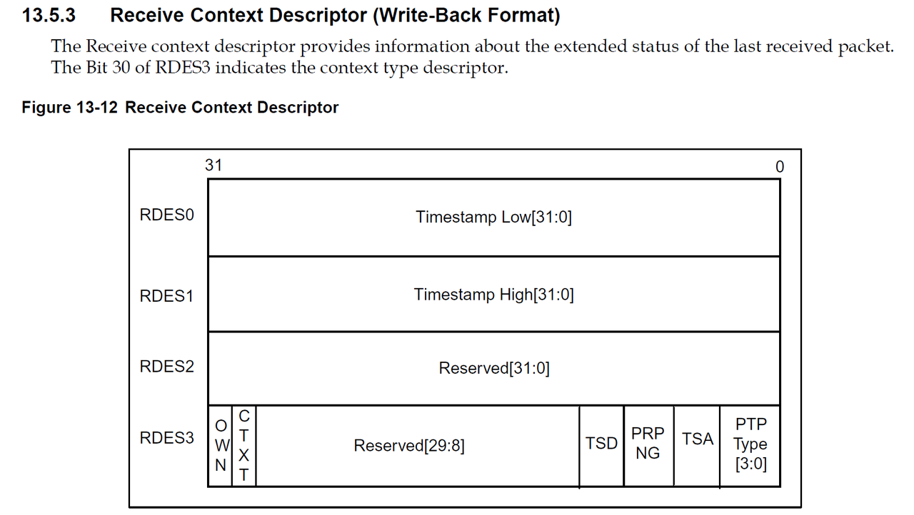

## 3.2 Hwstamp

```c
const struct stmmac_hwtimestamp stmmac_ptp = {
    .config_hw_tstamping = config_hw_tstamping,
    .init_systime = init_systime,
    .config_sub_second_increment = config_sub_second_increment,
    .config_addend = config_addend,
    .adjust_systime = adjust_systime,
    .get_systime = get_systime,
    .get_ptptime = get_ptptime,
    .timestamp_interrupt = timestamp_interrupt,
};
```
### 3.2.1 `config_sub_second_increment`

```c
static void config_sub_second_increment(void __iomem *ioaddr,
        u32 ptp_clock, int gmac4, u32 *ssinc)
{
    u32 value = readl(ioaddr + PTP_TCR);
    unsigned long data;
    u32 reg_value;

    /* For GMAC3.x, 4.x versions, in "fine adjustement mode" set sub-second
     * increment to twice the number of nanoseconds of a clock cycle.
     * The calculation of the default_addend value by the caller will set it
     * to mid-range = 2^31 when the remainder of this division is zero,
     * which will make the accumulator overflow once every 2 ptp_clock
     * cycles, adding twice the number of nanoseconds of a clock cycle :
     * 2000000000ULL / ptp_clock.
     */
    if (value & PTP_TCR_TSCFUPDT)
        data = (2000000000ULL / ptp_clock);
    else
        data = (1000000000ULL / ptp_clock);

    /* 0.465ns accuracy */
    if (!(value & PTP_TCR_TSCTRLSSR))
        data = (data * 1000) / 465;

    if (data > PTP_SSIR_SSINC_MAX)
        data = PTP_SSIR_SSINC_MAX;

    reg_value = data;
    if (gmac4)
        reg_value <<= GMAC4_PTP_SSIR_SSINC_SHIFT;

    writel(reg_value, ioaddr + PTP_SSIR);

    if (ssinc)
        *ssinc = data;
}
```

MAC_Sub_Second_Increment 用于指示每一个外部 clock 脉冲输入的时候，内部 counter 的增加值，从而获取时间偏移量。例如当外部输入为 50Mhz（20ns）的时候，每一跳就意味着该值需要增长 0x14。

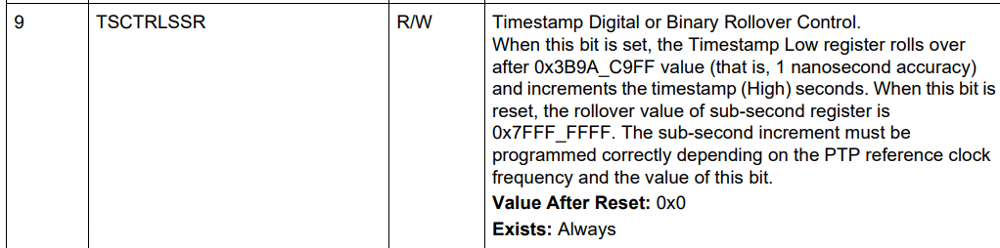

需要注意的是 xgmac 支持两种技术：十进制或者 32bit计数。前者增长至 0x3B9AC9FF，后者增长至 0x7FFFFFFF，这意味着在 32bit 精度计数的情况下每一个 counter 对应 0.465ns。

寄存器信息：
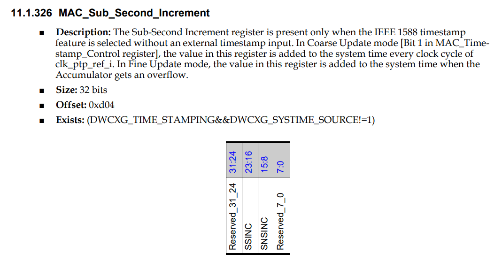
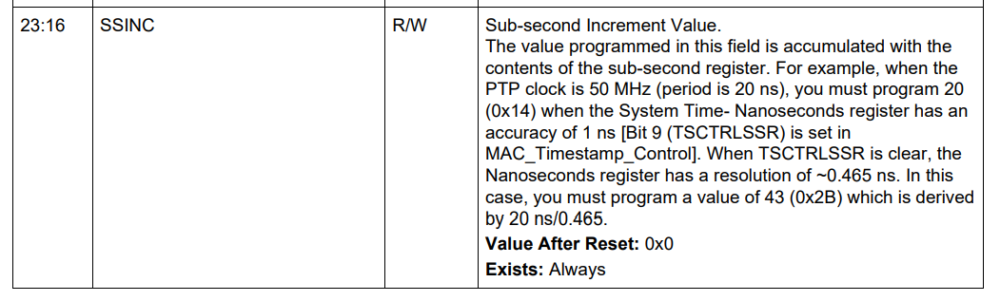
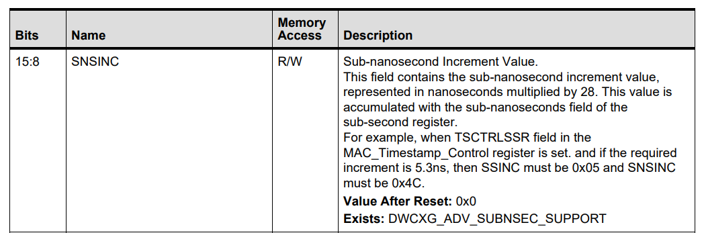

### 3.2.2 `init_systime`

```c
static int init_systime(void __iomem *ioaddr, u32 sec, u32 nsec)
{
    u32 value;

    writel(sec, ioaddr + PTP_STSUR);
    writel(nsec, ioaddr + PTP_STNSUR);
    /* issue command to initialize the system time value */
    value = readl(ioaddr + PTP_TCR);
    value |= PTP_TCR_TSINIT;
    writel(value, ioaddr + PTP_TCR);

    /* wait for present system time initialize to complete */
    return readl_poll_timeout_atomic(ioaddr + PTP_TCR, value,
                 !(value & PTP_TCR_TSINIT),
                 10, 100000);
}
```

初始化基础的系统时间。
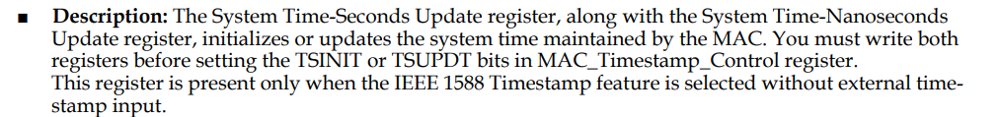

### 3.2.3 `config_addend`

```c
static int config_addend(void __iomem *ioaddr, u32 addend)
{
    u32 value;
    int limit;

    writel(addend, ioaddr + PTP_TAR);
    /* issue command to update the addend value */
    value = readl(ioaddr + PTP_TCR);
    value |= PTP_TCR_TSADDREG;
    writel(value, ioaddr + PTP_TCR);

    /* wait for present addend update to complete */
    limit = 10;
    while (limit--) {
        if (!(readl(ioaddr + PTP_TCR) & PTP_TCR_TSADDREG))
            break;
        mdelay(10);
    }
    if (limit < 0)
        return -EBUSY;

    return 0;
}
```

写完 addend 之后需要手动 trigger 一下 update bit，然后等待其完成
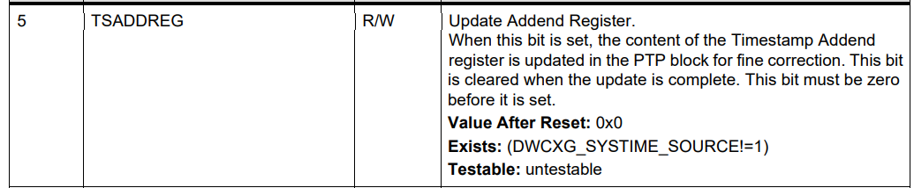

### 3.2.4 `adjust_systime`

```c
static int adjust_systime(void __iomem *ioaddr, u32 sec, u32 nsec,
        int add_sub, int gmac4)
{
    u32 value;
    int limit;

    if (add_sub) {
        /* If the new sec value needs to be subtracted with
         * the system time, then MAC_STSUR reg should be
         * programmed with (2^32 – <new_sec_value>)
         */
        if (gmac4)
            sec = -sec;

        value = readl(ioaddr + PTP_TCR);
        if (value & PTP_TCR_TSCTRLSSR)
            nsec = (PTP_DIGITAL_ROLLOVER_MODE - nsec);
        else
            nsec = (PTP_BINARY_ROLLOVER_MODE - nsec);
    }

    writel(sec, ioaddr + PTP_STSUR);
    value = (add_sub << PTP_STNSUR_ADDSUB_SHIFT) | nsec;
    writel(value, ioaddr + PTP_STNSUR);

    /* issue command to initialize the system time value */
    value = readl(ioaddr + PTP_TCR);
    value |= PTP_TCR_TSUPDT;
    writel(value, ioaddr + PTP_TCR);

    /* wait for present system time adjust/update to complete */
    limit = 10;
    while (limit--) {
        if (!(readl(ioaddr + PTP_TCR) & PTP_TCR_TSUPDT))
            break;
        mdelay(10);
    }
    if (limit < 0)
        return -EBUSY;

    return 0;
}
```

## 3.3 PTP hardware clock

```c
static struct ptp_clock_info stmmac_ptp_clock_ops = {
    .owner = THIS_MODULE,
    .name = "stmmac ptp",
    .max_adj = 62500000,
    .n_alarm = 0,
    .n_ext_ts = 0, /* will be overwritten in stmmac_ptp_register */
    .n_per_out = 0, /* will be overwritten in stmmac_ptp_register */
    .n_pins = 0,
    .pps = 0,
    .adjfreq = stmmac_adjust_freq,
    .adjtime = stmmac_adjust_time,
    .gettime64 = stmmac_get_time,
    .settime64 = stmmac_set_time,
    .enable = stmmac_enable,
    .getcrosststamp = stmmac_getcrosststamp,
};
```
