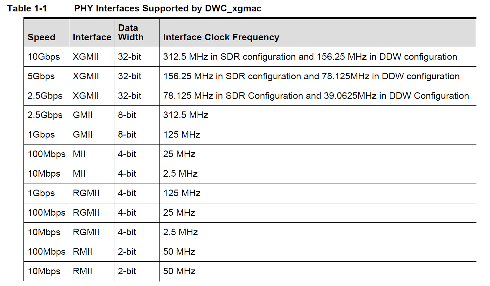
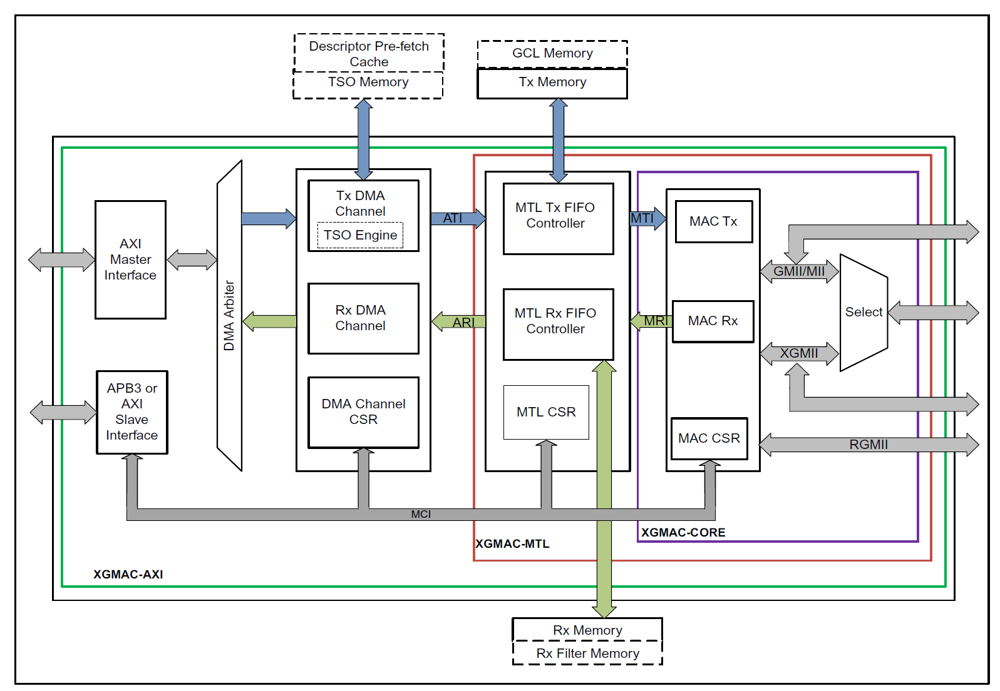

XGMAC 按照功能划分，从内到外有三个功能区：
- DMA: 处理由 CPU 操作的 desc 以及 tx/rx buffer prefetch，在发送一侧识别 DESC_OWN 字符并将描述符指示的数据传递至 MTL。RX 一侧将 MTL 传递的数据拷贝至 CPU 提供的 buffer 里并上报 DESC_OWN。
- MTL: 数据中转，将数据中转并分流成多个 queue。在 TX 一侧插入 VLAN tag 或者处理 TSO feature。RX 一侧对数据进行校验，上报正确数据包，舍弃异常数据包。
- MAC: 将 MTL 上报的 packet 转换成 MII/GMII/XGMII interface 并向外传输，遵循 MII 协议规范生成 preamble，SFD 等标志。

MAC 层做分层：
- Transmit Bus Interface Module (TBU)
	通过内部 64/128 bit 数据输入转换成内部信号，并对数据包进行定制 vlan tag & mac address，并将修正好的数据传递给 TFC
- Transmit Frame Controller Module (TFC)
	为数据添加 CRC 以及 pad bytes (以满足最小 64 bytes 数据需求)
- Transmit Protocol Engine Module (TPE)
	基于下游协议 (MII/GMII/XGMII) 进行适配 preamble, jam pattern 等，最终转换成 MII 协议信号对外发送。
	- XGMII: 生成SCC (8'b11011111) + preamble (8'b10101010 * 7Bytes) + SFD (8b'10101011) 并同步生成 TXC 脉冲。
	- GMII: 生成 preamble/SFD 并处理 TX_EN 与 TX_ER。
- Transmit Scheduler Module (STX)
	- 发包调度：在两笔包之间添加 inter-frame gap
	- 适配 SONET/SDH 降速需求。
- Transmit XGMII Interface FIFO (TIF)
	- 适配不同 XGMII 传递方式： SDR (312.5MHz) or DDR/DDW (156.25MHz)

# 收发包流程
由于 QNX 网络驱动是闭源模块 io-sock 的动态链接库，因此对网络收发包流程需按照 io-sock 模块规范做设计：

- https://www.qnx.com/developers/docs/8.0/com.qnx.doc.neutrino.io_sock/topic/native_drvr.html
- https://www.qnx.com/developers/docs/8.0/com.qnx.doc.neutrino.io_sock/topic/native_drvr_sample.html

与 QNX 样例一致，网络驱动在 device_attach 阶段创建结构体 ifnet，完成初始化后通过函数 ether_ifattach 与协议栈做绑定，后续操作流程便会通过 ifnet 结构体做收发包操作：

```c
static int stmmac_ifp_attach(struct stmmac_softc *sc)
{
    if_t ifp;

    sc->ifp = ifp = if_alloc(IFT_ETHER);
    if (!ifp)
        return ENXIO;

    if_setsoftc(ifp, sc);
    if_initname(ifp, device_get_name(sc->dev), device_get_unit(sc->dev));
    if_setflags(ifp, IFF_BROADCAST | IFF_SIMPLEX | IFF_MULTICAST);
    if_setcapabilities(ifp, IFCAP_VLAN_MTU);
    if_setcapenable(ifp, if_getcapabilities(ifp));
    if_settransmitfn(ifp, stmmac_if_transmit);
    if_setqflushfn(ifp, stmmac_if_qflush);
    if_setioctlfn(ifp, stmmac_if_ioctl);
    if_setinitfn(ifp, stmmac_if_init);
    if_setsendqlen(ifp, TX_DESC_COUNT - 1);
    if_setsendqready(ifp);
    if_setifheaderlen(ifp, sizeof(struct ether_vlan_header));

    ether_ifattach(ifp, sc->hwaddr.octet);

    return 0;
}
```

## TX 流程

```c
int stmmac_if_transmit(if_t ifp, struct mbuf *m)
{
	struct stmmac_softc *sc = if_getsoftc(ifp);
	int ret, chan = select_tx_chan(sc);
	struct stmmac_tx_queue *txq;

	if (((if_getdrvflags(sc->ifp) & IFF_DRV_RUNNING) == 0) || !(sc->link_is_up))
		return -ENETDOWN;

	txq = &sc->tx_queue[chan];
	ret = drbr_enqueue(ifp, txq->tx_br, m);
	if (ret) {
	}

	taskqueue_enqueue(txq->tx_taskq, &txq->tx_task);
	return ret;
}

...
if_settransmitfn(ifp, stmmac_if_transmit);
...
```
当协议栈出现发包需求的时候，其会通过 ifnet::if_transmit 接口调用驱动注册的函数 stmmac_if_transmit 向驱动传递一个 mbuf 结构体。网卡驱动会将 mbuf 指针保存进 ringbuffer 中后唤醒 tx task。在 txtask 中做硬件发包流程：

```c
static int stmmac_setup_txbuf(struct stmmac_softc *sc, uint32_t chan, int idx, struct mbuf **mp)
{
	struct bus_dma_segment segs[TX_MAP_MAX_SEGS];
	int error, nsegs;
	struct mbuf *m;
	uint32_t flags = 0;
	int i;
	int first, last;
	struct stmmac_tx_queue *tx_q = &sc->tx_queue[chan];
	struct stmmac_bufmap *bufmap = &tx_q->bufmap[idx];

	DEV_NETTRACE(sc->dev, "start");

	error = bus_dmamap_load_mbuf_sg(tx_q->txbuf_tag, bufmap->map,
		*mp, segs, &nsegs, 0);
	if (error == EFBIG) {
		/*
		 * The map may be partially mapped from the first call.
		 * Make sure to reset it.
		 */
		bus_dmamap_unload(tx_q->txbuf_tag, bufmap->map);
		m = m_defrag(*mp, M_NOWAIT);
		if (m == NULL)
			return ENOMEM;
		*mp = m;
		error = bus_dmamap_load_mbuf_sg(tx_q->txbuf_tag, bufmap->map,
			*mp, segs, &nsegs, 0);
	}
	if (error != 0)
		return ENOMEM;

	if (nsegs > TX_MAP_MAX_SEGS) {
		DEV_NETERROR(sc->dev, "nsegs overflowed!: %d", nsegs);
		bus_dmamap_unload(tx_q->txbuf_tag, bufmap->map);
		return EINVAL;
	}

	m = *mp;

	bus_dmamap_sync(tx_q->txbuf_tag, bufmap->map, BUS_DMASYNC_PREWRITE);
	bufmap->mbuf = m;

	first = last = tx_q->tx_desc_head;
	for (i = 0; i < nsegs; i++) {
		stmmac_setup_txdesc(sc, chan, tx_q->tx_desc_head,
			segs[i].ds_addr, segs[i].ds_len,
			(i == 0) ? flags : 0, /* only first desc needs flags */
			(i == 0),
			(i == nsegs - 1));

		if (i > 0)
			stmmac_set_owner(sc, chan, tx_q->tx_desc_head);
		last = tx_q->tx_desc_head;

		tx_q->tx_desc_head = next_txidx(tx_q->tx_desc_head);
	}

	bufmap->last_desc_idx = last;

	if (PTP_TX_TIMESTAMP(m))
		stmmac_enable_tx_timestamp(stmmac_get_txdesc(sc, chan, first));

	stmmac_set_owner(sc, chan, first);

	// stmmac_flush_tx_descriptors
	stmmac_set_tx_tail_ptr(sc, stmmac_get_txdesc_phy(sc, chan, last + 1), chan);

#if STMMAC_DUMP_BUF_EN
	stmmac_dump_buf("tx", m);
#endif

	DEV_NETTRACE(sc->dev, "chan=%d, first=%d, last=%d, tail=0x%lX",
		chan, first, last, stmmac_get_txdesc_phy(sc, chan, last));

	return 0;
}

static void stmmac_tx_task(void *arg, int pending)
{
    struct stmmac_tx_queue *txq = arg;
    struct stmmac_softc *sc = txq->sc;
    uint32_t chan = txq->queue_index;

    while (1) {
        int ret;
        struct mbuf *m0;

        if (ring_overflow(txq->tx_desc_head, txq->tx_desc_tail, TX_MAP_MAX_SEGS, TX_DESC_COUNT)
                || ring_overflow(txq->bufmap_head, txq->bufmap_tail, 1, TX_MAP_COUNT)) {
            if_setdrvflagbits(sc->ifp, IFF_DRV_OACTIVE, 0);
            stmmac_txfinish(sc, chan);
            // taskqueue_enqueue(txq->txfinish_taskq, &txq->txfinish_task);
            break;
        }

        m0 = drbr_peek(sc->ifp, txq->tx_br);
        if (m0 == NULL)
            break;

        ret = stmmac_setup_txbuf(sc, chan, txq->bufmap_head, &m0);
        if (ret) {
            drbr_putback(sc->ifp, txq->tx_br, m0);
            if_setdrvflagbits(sc->ifp, IFF_DRV_OACTIVE, 0);
            break;
        }

        BPF_MTAP(sc->ifp, m0);
        txq->bufmap_head = next_txidx(txq->bufmap_head);
        drbr_advance(sc->ifp, txq->tx_br);
    }

    // taskqueue_enqueue(txq->txfinish_taskq, &txq->txfinish_task);

    if (!drbr_empty(sc->ifp, txq->tx_br))
        taskqueue_enqueue(txq->tx_taskq, &txq->tx_task);
}
```

网卡驱动会在 txtask 中分别从 ringbuffer(tx_br) 中提取未发送的 mbuf，随后通过接口stmmac_setup_txbuf配置 desc 等硬件信息。如果发生溢出，则中断当前循环，通过重新通过 taskqueue_enqueue 接口在下一拍重新调用 txtask。

配置 txbuf 的流程涉及一系列描述符操作。其会将 mbuf 中的不同 segment 分别登记为单独的 txdesc，并将对应 txdesc 交还给 mac。同时驱动会判断 mbuf 是否包含 timestamp，从而通过配置对应 desc bit 指示 mac 捕获对应tx包的发送时间戳。

```c
uint32_t stmmac_txfinish(struct stmmac_softc *sc, uint32_t chan)
{
	uint32_t pkt_sent = 0;
	struct stmmac_tx_queue *tx_q = &sc->tx_queue[chan];

	// DEV_NETTRACE(sc->dev, "chan=%d start", chan);

	while (tx_q->bufmap_tail != tx_q->bufmap_head) {
		int idx, last_idx;
		boolean_t map_finished = true;
		struct stmmac_bufmap *bmap = &tx_q->bufmap[tx_q->bufmap_tail];

		idx = tx_q->tx_desc_tail;
		last_idx = next_txidx(bmap->last_desc_idx);
		while (idx != last_idx) {
			struct stmmac_desc *desc = stmmac_get_txdesc(sc, chan, idx);

			if (desc_owned(desc)) {
				/* descriptor owned by hw, exit */
				// DEV_NETTRACE(sc->dev, "chan=%d, desc %d owned", chan, idx);
				map_finished = false;
				break;
			}
			idx = next_txidx(idx);
		}

		if (!map_finished)
			break;

		/* ptp */
		stmmac_get_tx_hwtstamp(sc, bmap->mbuf);

		bus_dmamap_sync(tx_q->txbuf_tag, bmap->map, BUS_DMASYNC_POSTWRITE);
		bus_dmamap_unload(tx_q->txbuf_tag, bmap->map);

		// DEV_NETTRACE(sc->dev, "Packet transmitted: %d bytes", bmap->mbuf->m_len);
		m_freem(bmap->mbuf);
		bmap->mbuf = NULL;

		while (tx_q->tx_desc_tail != last_idx) {
			// DEV_NETTRACE(sc->dev, "TX desc%d freeed", tx_q->tx_desc_tail);
			stmmac_setup_txdesc(sc, chan, tx_q->tx_desc_tail, 0, 0, 0, false, false);
			tx_q->tx_desc_tail = next_txidx(tx_q->tx_desc_tail);
		}

		if_inc_counter(sc->ifp, IFCOUNTER_OPACKETS, 1);
		if_setdrvflagbits(sc->ifp, 0, IFF_DRV_OACTIVE);
		tx_q->bufmap_tail = next_txidx(tx_q->bufmap_tail);
		pkt_sent++;
		// DEV_NETTRACE(sc->dev, "buf_tail=%d, buf_head=%d", tx_q->bufmap_tail, tx_q->bufmap_head);
	}

	return pkt_sent;
}
```

出于性能方面的考虑，完成 tx desc 注册后并不会在当前线程中等待发包完成。驱动提供了单独的接口 stmmac_txfinish 以释放 txdesc 与 mbuf。txfinish 流程定义为三种情况做调用：
  1. 当驱动尝试做发包但是已无发送资源可用时
  2. 特定绑定了中断的 tx packet 触发了 tx 中断时
  3. 后台每秒触发一次的 tick 流程调用

### RX 流程

```c
uint32_t stmmac_rxfinish(struct stmmac_softc *sc, uint32_t chan)
{
	int ret;
	uint32_t rx_count = 0;
	struct stmmac_rx_queue *rx_q = &sc->rx_queue[chan];

	for (;;) {
		bool has_ctxt;
		struct mbuf *m, *new_m;
		struct stmmac_desc *desc = stmmac_get_rxdesc(sc, chan, rx_q->rx_idx);

		wmb();

		if (unlikely(desc->desc3 & DWC_XGMAC_RDESC3_OWN))
			break;

		rx_count++;
		DEV_NETTRACE(sc->dev, "chan=%d, desc%d owned by the mac", chan, rx_q->rx_idx);

		m = stmmac_rxfinish_one(sc, chan, rx_q->rx_idx);

		/* ptp */
		has_ctxt = stmmac_rxfinish_ptp(sc, chan, m);

		/* setup 1st desc */
		new_m = stmmac_alloc_mbufcl(sc);
		if (unlikely(new_m == NULL)) {
			/**
			 * no new mbuf available,
			 * discard current packet and recycle old
			 */
			if_inc_counter(sc->ifp, IFCOUNTER_IQDROPS, 1);

			wmb();
			desc->desc3 = DWC_XGMAC_RDESC3_OWN;
			wmb();
			rx_q->rx_idx = next_rxidx(rx_q->rx_idx);
		} else {
			/* report */
			if_inc_counter(sc->ifp, IFCOUNTER_IPACKETS, 1);
			if_input(sc->ifp, m);

			/* Update new rx buf/desc */
			ret = stmmac_setup_rxbuf(sc, chan, rx_q->rx_idx, new_m);
			if (unlikely(ret)) {
				DEV_NETERROR(sc->dev, "reset rxbuf error: %d", ret);
			}
			rx_q->rx_idx = next_rxidx(rx_q->rx_idx);
		}

		/* setup 2nd desc */
		if (unlikely(has_ctxt)) {
			ret = stmmac_setup_rxbuf(sc, chan, rx_q->rx_idx, NULL);
			if (ret) {
				DEV_NETERROR(sc->dev, "reset rxbuf error: %d", ret);
			}
			rx_q->rx_idx = next_rxidx(rx_q->rx_idx);
		}
	}
	return rx_count;
}
```
