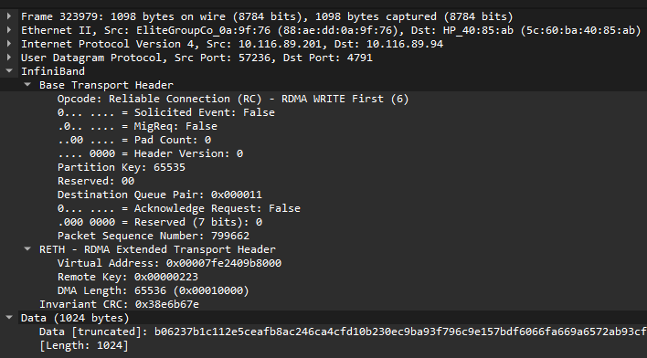
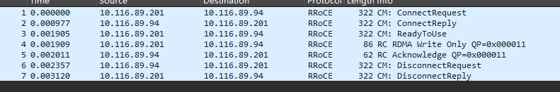

一个完整的 RoCEv2 数据包 包含以下层级结构:

```
以太网帧头 (Ethernet II)
├── IP 头 (IPv4 / IPv6)
├── UDP 头 (Dst Port: 4791)
├── InfiniBand BTH (Base Transport Header)
├── InfiniBand Extended Transport Header (RETH / AETH / DETH 等)
├── Payload (数据载荷)
└── ICRC / Variant CRC (校验码)
```

- [Makefile](rdma-test.assets/demo/Makefile)
- [rdma_demo.c](rdma-test.assets/demo/rdma_demo.c)

```bash
# 配置 rxe 网卡
sudo apt install -y rdma-core libibverbs1 librdmacm1 ibverbs-utils perftest
sudo rdma link add rxe0 type rxe netdev eno1

# 确认 rxe 状态
rdma link show
ibv_devices

# 编译 demo 文件
sudo apt install -y build-essential libibverbs-dev librdmacm-dev
make

# srv: 10.116.89.94
sudo ./rdma_demo server -a 10.116.89.94
# cli: 10.116.89.201
sudo ./rdma_demo client -a 10.116.89.94 -m "Hello RDMA!"
```

[demo.pcap](rdma-test.assets/demo.pcap)


## rdma_create_id

`rdma_create_id` 是 RDMA CM（Connection Manager）里分配一个通信标识符的入口，可以把它类比成 TCP 里 `socket()` 的第一步。对应 rdma-core 内部的流程:

```c
static int rdma_create_id2(...)
{
    id_priv = ucma_alloc_id(channel, context, ps, qp_type);
    if (!id_priv)
        return ERR(ENOMEM);

    CMA_INIT_CMD_RESP(&cmd, sizeof cmd, CREATE_ID, &resp, sizeof resp);
    cmd.uid = (uintptr_t) id_priv;
    cmd.ps = ps;
    cmd.qp_type = qp_type;

    ret = write(id_priv->id.channel->fd, &cmd, sizeof cmd);
    if (ret != sizeof(cmd)) {
        ret = (ret >= 0) ? ERR(ENODATA) : -1;
        goto err;
    }

    VALGRIND_MAKE_MEM_DEFINED(&resp, sizeof resp);

    id_priv->handle = resp.id;
    ucma_insert_id(id_priv);
    *id = &id_priv->id;
    return 0;
}
```
其内部对应一个 id_priv 通过 write fd 的方法注册进入内核的 ucma, 暴露出 id 给用户态用于后续的操作.

